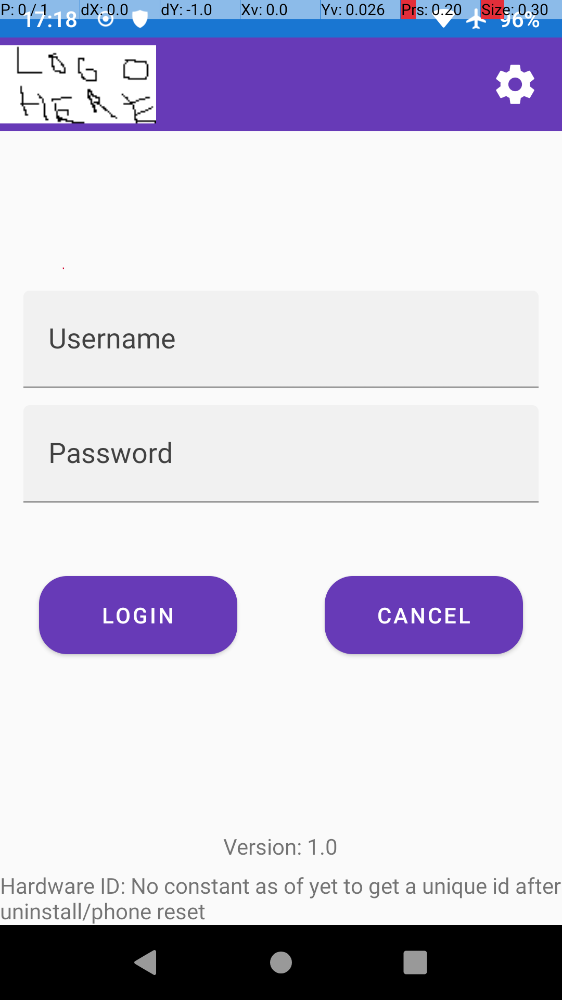
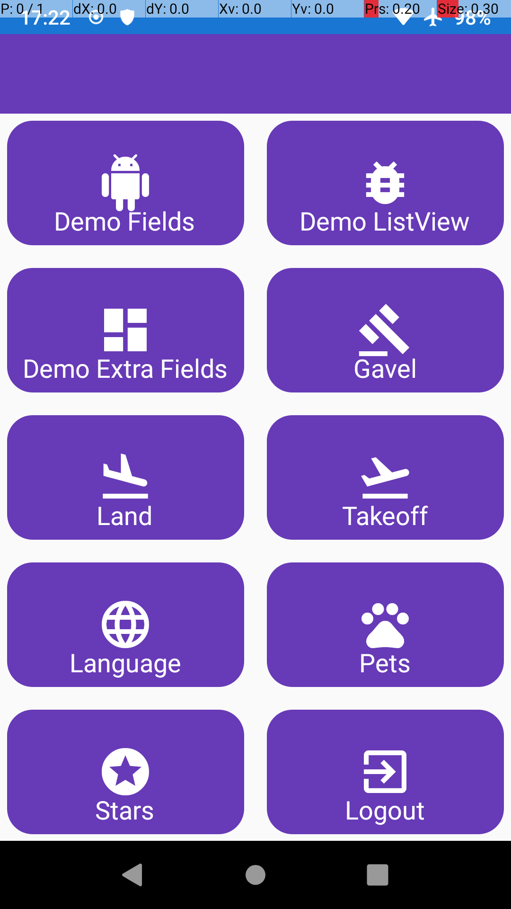
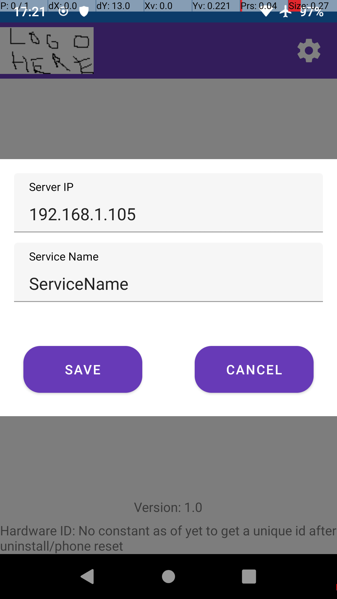
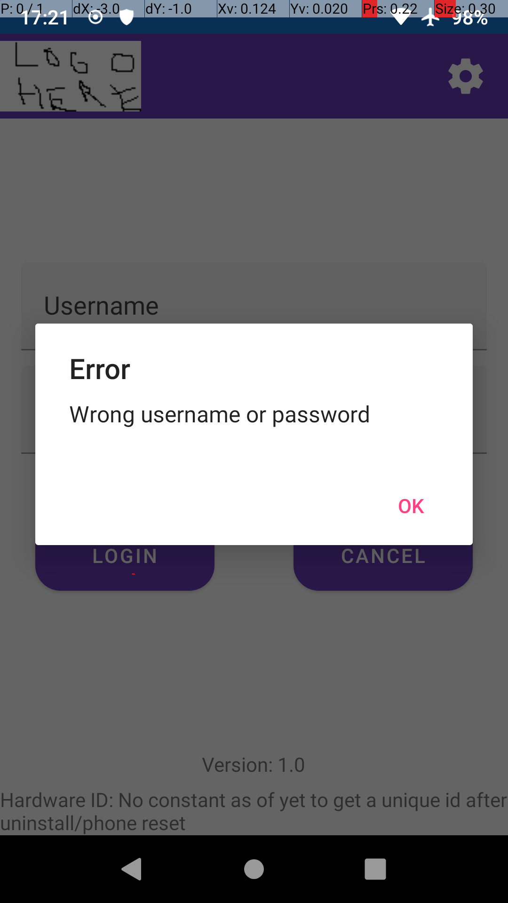
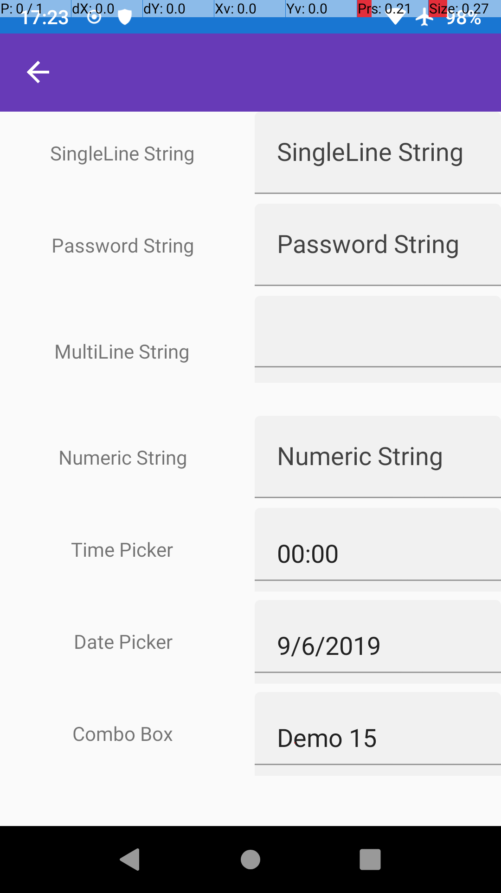
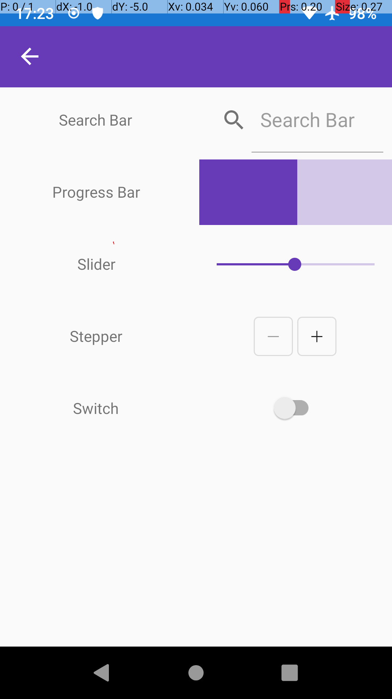
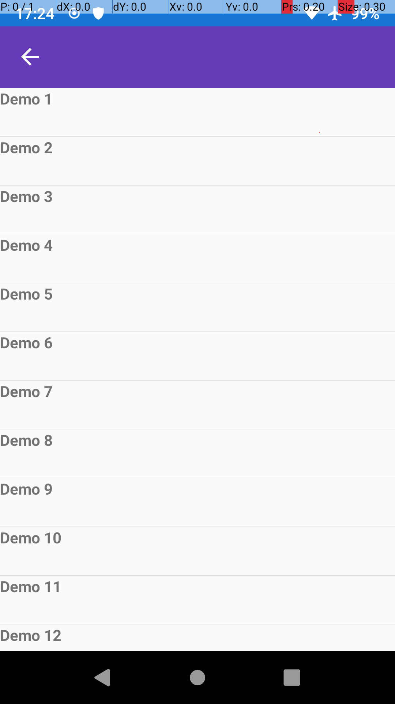
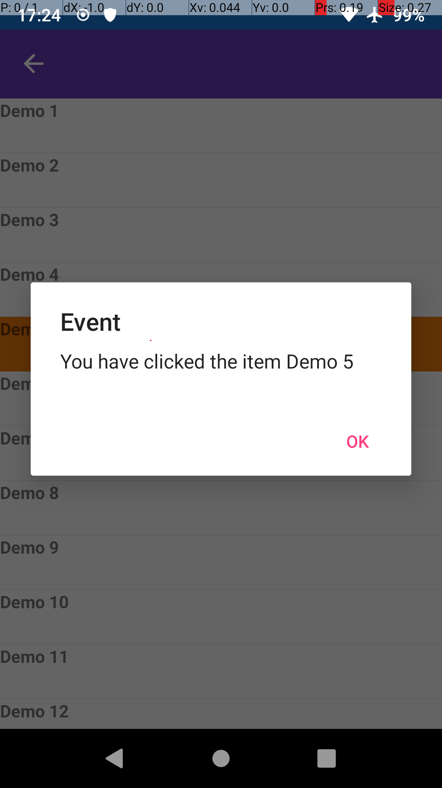

# Open Framework for Business Xamarin
Free cross-platform (Android and iOS) Starter Project written in Xamarin that contains the minimum requirements to create a custom application
## FAQ:
1. ***What is this?***  
This is a cross-platform (Android and iOS) Xamarin based project that contains the necessary controls and libraries in order to create an application for a custom business flow.
2. ***Why did you do it?***  
Honestly I did not used Xamarin before and I wanted to see what is it all about. For a couple of hours total time spent spanning two days I belive it was worth the time.
3. ***What does the project contain?***  
- Material Design Interface
- Material Design Icons
- Customizable popups
- Easy networking framework
- Generic loading screen popup with easy management
- Two column all screen main menu
- Back Navigation Example
- All available Xamarin fields example
- Item List with click event example
4. ***Who uses the project now?***  
Currently no one but I belive it is a good starting point for anyone wanting to learn Xamarin.
## Screenshots:  
***Login Screen  
  
Main Menu  
  
Popups  

  
Demo Fields  

  
Demo Listview***  

  

## Libraries Used:  
- Networking:
  - https://github.com/tmenier/Flurl
- Popups:
  - https://github.com/rotorgames/Rg.Plugins.Popup
- Material Icons:
  - https://github.com/jsmarcus/Iconize
- Material Design:
  - https://docs.microsoft.com/en-us/xamarin/xamarin-forms/user-interface/visual/material-visual
- Shared Preferences Storage:
  - https://docs.microsoft.com/en-us/xamarin/essentials/
